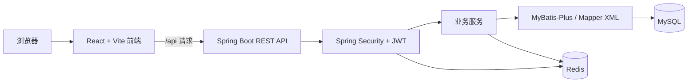

# 开发说明

本文描述当前仓库代码实现的系统结构、业务功能和数据库表。代码入口分别是 `work-platform-react/src/index.jsx` 与 `work-platform-server/src/main/java/com/personalwork/WorkPlatformServerApplication.java`；表结构以 `work-platform-server/sql/personal_work.sql` 为准。

## 1. 系统架构

| 层次 | 位置 | 职责 |
| --- | --- | --- |
| 页面与交互 | `work-platform-react/src/screens/`、`components/` | 路由页面、表单、日历和图表 |
| 请求层 | `work-platform-react/src/request/` | 封装 `/api` 请求，在请求头中传递 `token` |
| 接口层 | `work-platform-server/src/main/java/com/personalwork/controller/` | 对外提供项目、清单、日程、统计等 REST 接口 |
| 认证层 | `security/` | 注册、登录、JWT 校验及接口访问控制 |
| 业务层 | `service/` | 业务校验、数据维护、统计计算 |
| 持久化层 | `dao/`、`src/main/resources/mapper/` | MyBatis-Plus Mapper 与 XML SQL |
| 存储层 | `sql/personal_work.sql`、Redis | MySQL 存储业务数据；Redis 存储登录用户信息和部分接口缓存 |

`WebMvcConfig` 为 `@RestController` 接口统一添加 `/api` 前缀。前端路由定义在 `src/index.jsx`，Vite 开发代理在 `vite.config.mjs` 中把 `/api` 转发到后端。登录时前端获取 RSA 公钥并提交加密后的密码；后端完成认证后签发 JWT，前端将其放在 `token` 请求头中。后端同时校验 JWT 和 Redis 中的登录用户信息。业务读取使用当前登录用户身份；数据库多数业务表通过 `user_id` 归属用户。

日程记录保存在 `project_time`。创建、修改或删除日程时，`ScheduleService` 更新受影响的周记录与项目用时；周/月统计服务再汇总这些记录。清单可以与日程关联，清单名称变更会同步到其关联日程。缓存逻辑位于 `system/cache/`，周、月列表等接口使用 Redis 缓存并在对应写操作后失效。

## 2. 全部功能说明

以下按 `src/index.jsx` 中注册的前端页面说明。接口列出该页面及其直接使用的子组件、钩子发起的请求；同一接口可在多个页面出现。接口路径均包含 `/api` 前缀，`{id}` 等表示路径参数。

### 2.1 登录与注册页 `/login`

页面在登录和注册表单之间切换。登录、注册前获取 RSA 公钥，前端加密密码后提交；登录成功后保存用户信息和令牌并进入业务页面。

- `GET /api/auth/rsa/public-key`：获取密码加密用公钥。
- `POST /api/auth/login`：登录并获取令牌。
- `POST /api/auth/register`：注册账号。

### 2.2 项目列表页 `/`、`/projects`

页面加载项目与项目类型树。左侧可选择类型、新增/编辑/删除类型、调整类型层级和颜色；右侧可按名称、日期、重要程度、状态筛选项目，并排序、分页、批量删除。新增和编辑项目使用弹窗；删除前会检查项目是否已有统计记录。类型筛选和项目列表的交互主要在前端处理。

- `GET /api/projects`、`GET /api/types/tree`：加载项目和类型树。
- `POST /api/projects`、`PUT /api/projects/{id}`、`DELETE /api/projects/{ids}`：新增、编辑和删除项目。
- `GET /api/projects/{id}/exist-record`：删除前查询项目是否已有记录。
- `POST /api/types`、`PUT /api/types/{id}`、`DELETE /api/types/{ids}`：维护项目类型。

### 2.3 项目新建与编辑页 `/addProject`、`/project/:id`

这两个独立路由使用项目表单维护名称、类型、起止日期、进度、状态、重要程度等信息。编辑页先按编号读取项目；类型选择器读取项目类型树。项目列表页也提供同类新增和编辑弹窗。

- `GET /api/projects/{id}`：编辑页加载项目详情。
- `GET /api/types/tree`：加载类型选项。
- `POST /api/projects`：新建项目。
- `PUT /api/projects/{id}`：保存项目修改。

### 2.4 清单页 `/checklists`

页面按清单类型展示未完成清单，可切换类型、查看全部或指定类型的已完成清单。支持新建、编辑、删除清单，关联项目和清单类型，切换完成状态。新建时若填写日程时间，页面会直接创建关联日程。左侧类型树支持新增、编辑、删除与拖动调整层级。

- `GET /api/checklists`、`GET /api/checklist-types/tree`、`GET /api/projects`：加载清单、类型和项目。
- `POST /api/checklists`、`PUT /api/checklists/{id}`、`PUT /api/checklists/{id}/state`、`DELETE /api/checklists/{id}`：维护清单。
- `POST /api/schedule`：新建清单时一并设置日程时间。
- `POST /api/checklist-types`、`PUT /api/checklist-types/{id}`、`DELETE /api/checklist-types/{id}`：维护清单类型。

### 2.5 日程页 `/schedule`

页面通过日历展示日程，可选择时间段创建、编辑、拖动或调整日程，也可从侧边栏拖入项目或清单。侧边栏提供项目/清单树；日程可关联项目和清单，切换关联清单的完成状态。页面按当前日历范围展示项目时间统计，并支持饼图/柱状图切换。隐藏时间段设置保存在浏览器 `localStorage`，不调用后端接口。

- `GET /api/schedule`、`GET /api/types/tree`、`GET /api/projects`、`GET /api/checklist-types/tree`、`GET /api/checklists`：加载日程及侧边栏数据。
- `POST /api/schedule`、`PUT /api/schedule/{id}`、`DELETE /api/schedule/{id}`：创建、调整和删除日程。
- `PUT /api/checklists/{id}`、`PUT /api/checklists/{id}/state`：编辑关联清单或切换其完成状态。

### 2.6 问题库页 `/problems`

页面按日期范围、所属周、状态和级别查询问题。支持新增、编辑标题/级别/解决方法/所属周，批量删除，以及将问题标记为已解决或撤回解决状态。

- `GET /api/problems`：查询问题列表。
- `POST /api/problems`、`PUT /api/problems/{id}`、`DELETE /api/problems/{ids}`：新增、编辑和批量删除问题。
- `PUT /api/problems/{id}/done`、`PUT /api/problems/{id}/callback`：解决或撤回问题。

### 2.7 周统计列表页 `/weeks`

页面将周记录按年月分组，显示周卡片与日期导航，点击卡片进入周记录详情。该页只读取列表数据。

- `GET /api/statistics/weeks`：加载周记录列表。

### 2.8 周统计表单页 `/weeks/form/add`、`/weeks/form/:weekId`

页面展示一周的日程、任务用时与饼图、项目成果、周目标、问题、评价和总结。创建页选择周次并提交周记录；详情页可修改或删除记录。新增问题时会校验同名问题，创建周记录前还会检查该周是否已存在。周目标可在表单内新增、删除和切换状态；问题也可在表单内更新或标记解决。项目成果和周内问题随周表单一起提交。

- `GET /api/statistics/weeks/{id}`、`GET /api/schedule`、`GET /api/week-goals`：加载周记录、日程和目标。
- `GET /api/statistics/weeks/is-exists`、`GET /api/problems/is-exist`：提交前检查周记录与问题是否重复。
- `POST /api/statistics/weeks`、`PUT /api/statistics/weeks/{id}`、`DELETE /api/statistics/weeks/{id}`：创建、保存和删除周记录。
- `POST /api/week-goals`、`PUT /api/week-goals/{id}/change-state`、`DELETE /api/week-goals/{ids}`：在表单中维护周目标。
- `PUT /api/problems/{id}`、`PUT /api/problems/{id}/done`：在表单中修改或解决已有问题。
- `GET /api/projects`：选择目标或项目成果所关联的项目时加载项目列表。

### 2.9 月统计列表页 `/months`

页面按年份展示月记录卡片、月度用时与总结状态，点击卡片进入月记录详情，并提供“重新统计”操作。

- `GET /api/statistics/months`：加载月记录列表。
- `PUT /api/statistics/months/recount`：重新计算月度统计。

### 2.10 月统计表单页 `/months/form/:monthId`

页面展示本月任务用时、占比图、月目标和问题，可编辑月度评价与总结。目标可在表单内新增、删除和切换状态，已有问题可修改或标记解决。

- `GET /api/statistics/months/{id}`：加载月记录和项目用时。
- `GET /api/problems`、`GET /api/month-goals`：加载当月问题和目标。
- `PUT /api/statistics/months/{id}`：保存月度评价与总结。
- `POST /api/month-goals`、`PUT /api/month-goals/{id}/change-state`、`DELETE /api/month-goals/{ids}`：在表单中维护月目标。
- `PUT /api/problems/{id}`、`PUT /api/problems/{id}/done`：在表单中修改或解决问题。
- `GET /api/projects`：选择月目标关联项目时加载项目列表。

### 2.11 统计图表页 `/chart`

页面提供每周利用时间、每月利用时间和利用时间占比图。可选择时间范围以及按项目或项目类型查看统计结果；项目和类型筛选器会加载对应选项。

- `GET /api/chart/week-time-count`、`GET /api/chart/month-time-count`：加载周/月时间趋势。
- `GET /api/chart/work-time-proportion`：加载利用时间占比。
- `GET /api/projects`、`GET /api/types/tree`：加载筛选选项。

### 2.12 周目标页 `/goal/weeks`

页面按周展示目标卡片，可添加当前周目标、选择关联项目、批量删除目标并切换完成状态。

- `GET /api/week-goals`：加载周目标。
- `POST /api/week-goals`、`PUT /api/week-goals/{id}/change-state`、`DELETE /api/week-goals/{ids}`：新增、切换状态和删除目标。
- `GET /api/projects`：选择目标关联项目时加载项目列表。

### 2.13 月目标页 `/goal/months`

页面按月展示目标卡片，可添加当前月目标、选择关联项目、批量删除目标并切换完成状态。

- `GET /api/month-goals`：加载月目标。
- `POST /api/month-goals`、`PUT /api/month-goals/{id}/change-state`、`DELETE /api/month-goals/{ids}`：新增、切换状态和删除目标。
- `GET /api/projects`：选择目标关联项目时加载项目列表。

### 2.14 公共页面操作

业务页面共用侧边导航和用户头像菜单。头像菜单的退出操作调用 `POST /api/auth/logout`，清除前端保存的登录信息并跳转到 `/login`。

### 2.15 关键业务关系

- 项目属于用户，并通过 `type` 归类；项目时间记录、清单、目标和项目进展可关联项目。
- 清单属于用户，可关联项目及清单类型；日程通过 `project_time.checklist_id` 关联清单。
- 周记录以 `record_week.date` 表示该周第一天；`project_time.week_id`、`problem.week_date`、`week_goal.week_date` 与周维度相关。
- 月记录保存总结、评价与工作时间；`month_project_count` 保存月度项目用时汇总。
- 周、月统计会按日程时间段计算任务用时；图表接口提供周/月趋势与占比数据。

## 3. 数据库表设计

数据库初始化文件为 `work-platform-server/sql/personal_work.sql`，使用 MySQL/InnoDB。该文件包含 14 张表及 `DROP TABLE IF EXISTS`，仅适合新建或可重置的数据库。现有数据库的增量变更位于 `work-platform-server/sql/upgrade/`。以下字段清单按当前初始化 SQL 列出；`—` 表示 SQL 中未提供字段注释或默认值。

### 3.1 表概览

| 表名 | 用途 | 主要关联 |
| --- | --- | --- |
| `user` | 用户账号 | 其他业务表中的 `user_id` |
| `type` | 项目类型树 | `parentid` 自关联、`project.type` |
| `project` | 项目基本信息 | `type`、`user_id` |
| `checklist_type` | 清单类型树 | `parentid` 自关联、`checklist.checklist_type_id` |
| `checklist` | 清单项 | `project_id`、`checklist_type_id`、`user_id` |
| `project_time` | 项目日程和用时 | `project_id`、`week_id`、`checklist_id` |
| `problem` | 问题库 | `week_date`、`user_id` |
| `record_week` | 周总结与评价 | `date`、`user_id` |
| `record_month` | 月总结与评价 | `year`、`month`、`user_id` |
| `week_project_time_count` | 周项目用时汇总 | `week_id`、`project` |
| `month_project_count` | 月项目用时汇总 | `month_id`、`project_id` |
| `project_progress_week` | 周项目进展文本 | `week_id`、`project_id`、`user_id` |
| `week_goal` | 周目标 | `project_id`、`week_date`、`user_id` |
| `month_goal` | 月目标 | `project_id`、`year`、`month`、`user_id` |

SQL 中未声明外键约束；上表的关联为字段和代码所表达的业务关系。各表的 `gmt_create`、`gmt_modified` 分别记录创建和修改时间。

### 3.2 全部字段

#### `month_goal`

| 字段 | 类型 | 可为空 | 默认值 | 注释 |
| --- | --- | --- | --- | --- |
| `id` | `int(11)` | 否 | `—` | 自增 |
| `month` | `tinyint(4)` | 否 | `—` | — |
| `year` | `year(4)` | 否 | `—` | — |
| `project_id` | `int(11)` | 否 | `—` | — |
| `content` | `varchar(255)` | 否 | `—` | — |
| `is_done` | `tinyint(4)` | 是 | `NULL` | 0:未完成 1:已完成 |
| `gmt_create` | `datetime` | 是 | `CURRENT_TIMESTAMP` | — |
| `gmt_modified` | `datetime` | 是 | `CURRENT_TIMESTAMP` | — |
| `user_id` | `int(11)` | 否 | `—` | — |

索引：`PRIMARY KEY (id)`。

#### `month_project_count`

| 字段 | 类型 | 可为空 | 默认值 | 注释 |
| --- | --- | --- | --- | --- |
| `id` | `int(11)` | 否 | `—` | 自增 |
| `project_id` | `int(11)` | 是 | `NULL` | — |
| `minute` | `int(11)` | 是 | `NULL` | — |
| `month_id` | `int(11)` | 是 | `NULL` | — |
| `gmt_create` | `datetime` | 是 | `CURRENT_TIMESTAMP` | — |
| `gmt_modified` | `datetime` | 是 | `CURRENT_TIMESTAMP` | — |

索引：`PRIMARY KEY (id)`；`KEY month_id (month_id)`。

#### `problem`

| 字段 | 类型 | 可为空 | 默认值 | 注释 |
| --- | --- | --- | --- | --- |
| `title` | `varchar(255)` | 否 | `—` | — |
| `resolve` | `varchar(1000)` | 是 | `NULL` | — |
| `state` | `tinyint(4)` | 是 | `NULL` | 0 未解决 1 已解决 |
| `level` | `tinyint(4)` | 是 | `NULL` | 1 低 2 高 |
| `id` | `int(11)` | 否 | `—` | 自增 |
| `week_date` | `date` | 是 | `NULL` | 发生问题所属的周日期 |
| `gmt_create` | `datetime` | 是 | `CURRENT_TIMESTAMP` | — |
| `gmt_modified` | `datetime` | 是 | `CURRENT_TIMESTAMP` | — |
| `user_id` | `int(11)` | 否 | `—` | — |

索引：`PRIMARY KEY (id)`；`KEY title (title)`；`KEY state (state)`；`KEY level (level)`；`KEY week_date (week_date)`。

#### `project`

| 字段 | 类型 | 可为空 | 默认值 | 注释 |
| --- | --- | --- | --- | --- |
| `id` | `int(11)` | 否 | `—` | 自增 |
| `name` | `varchar(255)` | 否 | `—` | — |
| `startdate` | `date` | 是 | `NULL` | — |
| `enddate` | `date` | 是 | `NULL` | — |
| `type` | `int(11)` | 是 | `NULL` | — |
| `progress` | `double` | 是 | `NULL` | — |
| `state` | `int(11)` | 是 | `NULL` | 0:未开始 1:已开始 2:已结束 |
| `important` | `int(11)` | 是 | `NULL` | 0:不重要 1:重要 |
| `color` | `varchar(7)` | 是 | `NULL` | 项目显示颜色，HEX格式；为空时使用所属类型颜色 |
| `is_startdate_only` | `int(11)` | 是 | `NULL` | — |
| `close_date` | `date` | 是 | `NULL` | — |
| `gmt_create` | `datetime` | 是 | `CURRENT_TIMESTAMP` | — |
| `gmt_modified` | `datetime` | 是 | `CURRENT_TIMESTAMP` | — |
| `user_id` | `int(11)` | 否 | `—` | — |

索引：`PRIMARY KEY (id)`。

#### `project_progress_week`

| 字段 | 类型 | 可为空 | 默认值 | 注释 |
| --- | --- | --- | --- | --- |
| `id` | `int(11)` | 否 | `—` | 自增 |
| `week_id` | `int(11)` | 否 | `—` | — |
| `user_id` | `int(11)` | 否 | `—` | — |
| `project_id` | `int(11)` | 否 | `—` | — |
| `progress` | `varchar(1000)` | 否 | `—` | — |
| `gmt_create` | `datetime` | 是 | `CURRENT_TIMESTAMP` | — |
| `gmt_modified` | `datetime` | 是 | `CURRENT_TIMESTAMP` | — |

索引：`PRIMARY KEY (id)`。

#### `project_time`

| 字段 | 类型 | 可为空 | 默认值 | 注释 |
| --- | --- | --- | --- | --- |
| `project_id` | `int(11)` | 是 | `NULL` | — |
| `date` | `date` | 否 | `—` | — |
| `end_date` | `date` | 是 | `NULL` | — |
| `start_time` | `time` | 否 | `—` | — |
| `end_time` | `time` | 否 | `—` | — |
| `schedule_name` | `varchar(255)` | 是 | `NULL` | — |
| `description` | `varchar(1000)` | 是 | `NULL` | — |
| `id` | `int(11)` | 否 | `—` | 自增 |
| `week_id` | `int(11)` | 是 | `NULL` | — |
| `checklist_id` | `int(11)` | 是 | `NULL` | 关联清单id |
| `gmt_create` | `datetime` | 是 | `CURRENT_TIMESTAMP` | — |
| `gmt_modified` | `datetime` | 是 | `CURRENT_TIMESTAMP` | — |

索引：`PRIMARY KEY (id)`；`KEY week_id (week_id)`；`KEY checklist_id (checklist_id)`；`KEY date (date)`；`KEY project_id (project_id)`。

#### `checklist_type`

| 字段 | 类型 | 可为空 | 默认值 | 注释 |
| --- | --- | --- | --- | --- |
| `id` | `int(11)` | 否 | `—` | 自增 |
| `name` | `varchar(255)` | 否 | `—` | — |
| `parentid` | `int(11)` | 是 | `NULL` | — |
| `color` | `varchar(7)` | 是 | `NULL` | 类型显示颜色，HEX格式 |
| `gmt_create` | `datetime` | 是 | `CURRENT_TIMESTAMP` | — |
| `gmt_modified` | `datetime` | 是 | `CURRENT_TIMESTAMP` | — |
| `user_id` | `int(11)` | 否 | `—` | — |

索引：`PRIMARY KEY (id)`。

#### `checklist`

| 字段 | 类型 | 可为空 | 默认值 | 注释 |
| --- | --- | --- | --- | --- |
| `id` | `int(11)` | 否 | `—` | 自增 |
| `name` | `varchar(255)` | 否 | `—` | — |
| `project_id` | `int(11)` | 是 | `NULL` | — |
| `is_done` | `tinyint(4)` | 否 | `0` | 0:未完成 1:已完成 |
| `checklist_type_id` | `int(11)` | 是 | `NULL` | 所属清单类型id，为空时归入收集箱类型 |
| `gmt_create` | `datetime` | 是 | `CURRENT_TIMESTAMP` | — |
| `gmt_modified` | `datetime` | 是 | `CURRENT_TIMESTAMP` | — |
| `user_id` | `int(11)` | 否 | `—` | — |

索引：`PRIMARY KEY (id)`；`KEY project_id (project_id)`；`KEY checklist_type_id (checklist_type_id)`。

#### `record_month`

| 字段 | 类型 | 可为空 | 默认值 | 注释 |
| --- | --- | --- | --- | --- |
| `id` | `int(11)` | 否 | `—` | 自增 |
| `year` | `int(11)` | 否 | `—` | — |
| `month` | `int(11)` | 否 | `—` | — |
| `mark` | `int(11)` | 是 | `NULL` | 1:不合格 2:合格 3:优秀 |
| `summary` | `varchar(4000)` | 是 | `NULL` | — |
| `work_time` | `int(11)` | 否 | `—` | — |
| `is_summarize` | `tinyint(4)` | 是 | `NULL` | 是否总结，0：否 1：是 |
| `gmt_create` | `datetime` | 是 | `CURRENT_TIMESTAMP` | — |
| `gmt_modified` | `datetime` | 是 | `CURRENT_TIMESTAMP` | — |
| `user_id` | `int(11)` | 否 | `—` | — |

索引：`PRIMARY KEY (id)`。

#### `record_week`

| 字段 | 类型 | 可为空 | 默认值 | 注释 |
| --- | --- | --- | --- | --- |
| `id` | `int(11)` | 否 | `—` | 自增 |
| `date` | `date` | 否 | `—` | 周的第一天日期 |
| `time` | `int(11)` | 否 | `0` | 利用时间，单位：分 |
| `summary` | `varchar(1000)` | 是 | `NULL` | — |
| `mark` | `tinyint(4)` | 是 | `NULL` | 1:不合格 2:合格 3:优秀 |
| `gmt_create` | `datetime` | 是 | `CURRENT_TIMESTAMP` | — |
| `gmt_modified` | `datetime` | 是 | `CURRENT_TIMESTAMP` | — |
| `user_id` | `int(11)` | 否 | `—` | — |

索引：`PRIMARY KEY (id,date) USING BTREE`。

#### `type`

| 字段 | 类型 | 可为空 | 默认值 | 注释 |
| --- | --- | --- | --- | --- |
| `id` | `int(11)` | 否 | `—` | 自增 |
| `name` | `varchar(255)` | 否 | `—` | — |
| `parentid` | `int(11)` | 是 | `NULL` | — |
| `color` | `varchar(7)` | 是 | `NULL` | 类型显示颜色，HEX格式 |
| `gmt_create` | `datetime` | 是 | `CURRENT_TIMESTAMP` | — |
| `gmt_modified` | `datetime` | 是 | `CURRENT_TIMESTAMP` | — |
| `user_id` | `int(11)` | 否 | `—` | — |

索引：`PRIMARY KEY (id)`。

#### `user`

| 字段 | 类型 | 可为空 | 默认值 | 注释 |
| --- | --- | --- | --- | --- |
| `name` | `varchar(100)` | 否 | `—` | — |
| `email` | `varchar(100)` | 是 | `NULL` | — |
| `password` | `varchar(200)` | 否 | `—` | — |
| `id` | `int(11)` | 否 | `—` | 自增 |
| `gmt_create` | `datetime` | 是 | `CURRENT_TIMESTAMP` | — |
| `gmt_modified` | `datetime` | 是 | `CURRENT_TIMESTAMP` | — |
| `is_deleted` | `tinyint(4)` | 否 | `0` | — |
| `login_name` | `varchar(255)` | 否 | `—` | — |

索引：`PRIMARY KEY (id,login_name) USING BTREE`。

#### `week_goal`

| 字段 | 类型 | 可为空 | 默认值 | 注释 |
| --- | --- | --- | --- | --- |
| `id` | `int(11)` | 否 | `—` | 自增 |
| `project_id` | `int(11)` | 否 | `—` | — |
| `content` | `varchar(255)` | 否 | `—` | — |
| `is_done` | `tinyint(4)` | 是 | `NULL` | 0:未完成 1:完成 |
| `gmt_create` | `datetime` | 是 | `CURRENT_TIMESTAMP` | — |
| `gmt_modified` | `datetime` | 是 | `CURRENT_TIMESTAMP` | — |
| `user_id` | `int(11)` | 否 | `—` | — |
| `week_date` | `date` | 否 | `—` | — |

索引：`PRIMARY KEY (id)`。

#### `week_project_time_count`

| 字段 | 类型 | 可为空 | 默认值 | 注释 |
| --- | --- | --- | --- | --- |
| `id` | `int(11)` | 否 | `—` | 自增 |
| `week_id` | `int(11)` | 否 | `—` | — |
| `project` | `int(11)` | 否 | `—` | — |
| `minutes` | `int(11)` | 是 | `NULL` | — |
| `gmt_create` | `datetime` | 是 | `CURRENT_TIMESTAMP` | — |
| `gmt_modified` | `datetime` | 是 | `CURRENT_TIMESTAMP` | — |

索引：`PRIMARY KEY (id) USING BTREE`。
